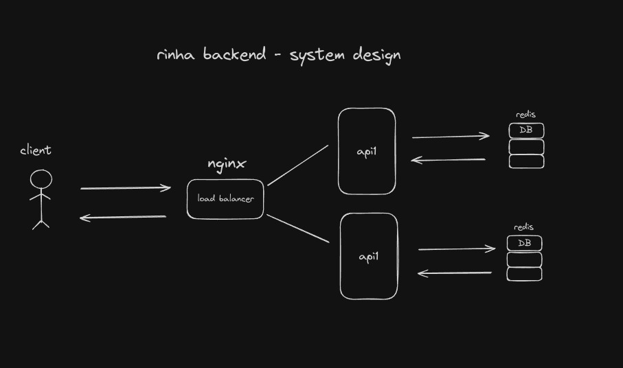

# Desafio Rinha de Backend feito em Python

[Repositório e especificação do desafio (direct link)](https://github.com/zanfranceschi/rinha-de-backend-2024-q1)

Nota: Esse trabalho está em andamento, a implementação de todas as especificações da rinha não foram feitas.
A lista de tecnologias e o system design irão mudar com o tempo.

## Como rodar (linux)

Verifique se você tem o docker instalado no seu sistema, na pasta raiz do projeto:

```
% make runall
```

Precisando ver os logs?

```
% make logs
```

## Tecnologias usadas

- Docker
- Nginx
- Python
- FastAPI

## System Design

